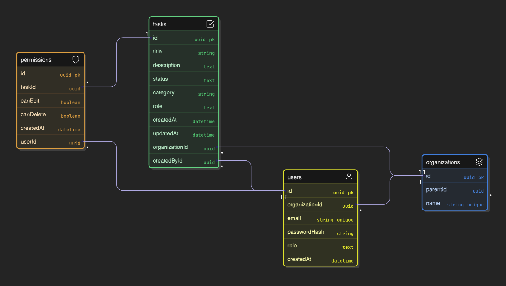

# Justin Jin

## Setup Instructions

- **Prerequisites:** Node.js 18+ (or compatible), npm (or yarn), and Git.
- **Install dependencies (root):**

```bash
npm install
```

- **Running the apps (development):** Using NX monorepo

```bash
# Start backend API
npx nx serve api

# Start frontend dashboard
npx nx serve dashboard
```

- **Seeding the database:** A seed js script is provided for the API.

```bash
npm run seed
```

- **Tests using Jest:**

```bash
npm test
```

### .env (API)

Create an `.env` file under `apps/api` (or provide these vars to your environment).

```
# apps/api/.env
DB_TYPE=sqlite
DB_PATH=apps/api/db.sqlite
JWT_SECRET=dev_secret
JWT_EXPIRES_IN=3000s
```

## Architecture Overview

Below is a concise guide to the internal structure of the backend (`apps/api`) and frontend (`apps/dashboard`). Use these paths to find controllers, modules, pages, components, and the tests that exercise them.

    - `apps/api/src/main.ts` — application bootstrap and configuration.
    - `apps/api/src/app/app.module.ts` — root module wiring submodules.
    - `apps/api/src/app/*` — domain folders (examples in this repo):
        - `auth/` — authentication controllers, strategies, guards, and DTOs.
        - `audit/` — audit controller/service for change logging.
        - `tasks/` — tasks controller, service, DTOs.
        - `organization/` — organization service and helpers.
        - `users/` — user-related modules and services.
        - `entities/` — TypeORM entity definitions (`user.entity.ts`, `task.entity.ts`, `organization.entity.ts`, `permission.entity.ts`).
    - `apps/api/src/app/*.service.ts` — business logic; keep services thin and testable.
    - `apps/api/src/app/*.controller.ts` — HTTP endpoints; controllers should delegate to services.
    - `apps/api/src/scripts/seed.ts` — local seeding utility used in development and CI.
    - `apps/api/tests/` — unit tests for services/controllers (Jest). Example: `apps/api/tests/auth`.
    - Persistence: configured via TypeORM. Default in this repo is SQLite (see `.env` and TypeORM config).

- **Frontend — `apps/dashboard`**
    - `apps/dashboard/src/main.ts` — frontend bootstrap.
    - `apps/dashboard/src/app/` — application code:
        - `routes/` — route definitions and navigation.
        - `pages/` — page-level modules (e.g., `login`, `task-dashboard`).
        - `components/` — reusable UI components (login form, task lists, etc.).
        - `services/` — client-side services for API calls and auth handling (e.g., `auth.service.ts`).
        - `guards/` and `interceptors/` — route guards and HTTP interceptors (e.g., auth guard, token interceptor).
        - `models/` — client-side models/types that mirror backend entities (e.g., `task.model.ts`).
    - `apps/dashboard/src/styles.css` / `public/` — static assets and global styles.
    - `apps/dashboard/tests/` — frontend unit / integration tests (if present).

- **Shared code**
    - `libs/*` — small focused libraries (auth helpers, shared types, enums) consumed by both apps via TypeScript path aliases in `tsconfig.base.json`.

    - To find an endpoint implementation: look under `apps/api/src/app/<domain>/*controller.ts` and the matching service.
    - To find the client usage: look under `apps/dashboard/src/app/<page>` and `services/` for API client calls.

### Rationale & trade-offs

This project structure emphasizes clear separation between backend and frontend responsibilities while keeping shared code in small libraries.

- **Why this structure:**
    - Separates HTTP surface (`controllers`/`pages`) from business logic (`services`) to make unit testing and reuse straightforward.
    - Mirrors domain boundaries (auth, tasks, users, organizations) so teams can work on features with minimal cross-impact.
    - Shared `libs/` reduce duplication for models, enums, and common utilities.

- **Frontend choices & trade-offs:**
    - Pages + components + services keeps UI concerns modular and testable; services encapsulate API calls and auth state.
    - Trade-off: this pattern can add boilerplate for small features and requires consistent conventions to avoid component duplication.

- **Backend choices & trade-offs:**
    - Using NestJS modules, controllers, and services enforces DI and clear boundaries; TypeORM entities live in `entities/` for a single source of truth.
    - Trade-off: Nest/TypeORM scaffolding increases initial complexity and learning curve; TypeORM adds runtime and migration complexity compared to raw SQL.

- **Monorepo pros & cons:**
    - Pros: single install, easier refactors across apps, consistent tooling and tests.
    - Cons: larger repository surface, more CI configuration, and potential for accidental dependency coupling between libraries.


## Data Model Explanation



Schema (text summary)

- **Organization**
    - `id` (uuid, PK)
    - `name` (string, unique)
    - `parentId` (uuid | null, FK -> Organization.id)
    - Relations: `parent` (ManyToOne), `children` (OneToMany)
    - Note: service enforces a 2-level hierarchy (no grandchildren).

- **User**
    - `id` (uuid, PK)
    - `email` (string, unique)
    - `passwordHash` (string)
    - `role` (enum: OWNER | ADMIN | VIEWER)
    - `organizationId` (uuid, FK -> Organization.id)
    - Relation: `organization` (ManyToOne, eager)
    - `createdAt` (datetime, default CURRENT_TIMESTAMP)

- **Task**
    - `id` (uuid, PK)
    - `title` (string)
    - `description` (text | null)
    - `status` (enum: TODO | IN_PROGRESS | DONE, default TODO)
    - `category` (string, default 'Work')
    - `role` (enum: target role for task)
    - `organizationId` (uuid, FK -> Organization.id)
    - Relation: `organization` (ManyToOne, eager)
    - `createdById` (uuid, FK -> User.id)
    - Relation: `createdBy` (ManyToOne, eager)
    - `createdAt`, `updatedAt` (datetime, default CURRENT_TIMESTAMP)

- **Permission**
    - `id` (uuid, PK)
    - `taskId` (uuid, FK -> Task.id)
    - Relation: `task` (ManyToOne, onDelete CASCADE)
    - `userId` (uuid, FK -> User.id)
    - Relation: `user` (ManyToOne, eager, onDelete CASCADE)
    - `canEdit` (boolean, default false)
    - `canDelete` (boolean, default false)
    - `createdAt` (datetime, default CURRENT_TIMESTAMP)

- **Enums**
    - `Role`: OWNER, ADMIN, VIEWER
    - `TaskStatus`: TODO, IN_PROGRESS, DONE


## Access Control Implementation
This project implements a simple RBAC-style access control layered with organization scoping and per-task permissions.

- **Roles & scope**
    - `Role` values: `OWNER`, `ADMIN`, `VIEWER` (see `libs/data/src/lib/role.enum.ts`).
    - Roles apply at the **organization** level: users belong to an organization and inherit role-based capabilities within that org.

- **Organization hierarchy**
    - Organizations are a 2-level hierarchy (root -> child). Services enforce that child orgs cannot have grandchildren.
    - Most data (Tasks, Users) are scoped to `organizationId` so access checks first verify org membership or role within the org.

- **Per-resource permissions**
    - `Permission` records tie a `user` to a `task` with explicit booleans `canEdit` and `canDelete`.
    - Resource-level checks consult `Permission` first for explicit overrides, then fall back to role-based rules.

- **How JWT integrates**
    - On login, JWTs are signed with a payload containing `sub` (user id), `email`, `role`, and `organizationId`.
    - The API uses Passport JWT strategy (`apps/api/src/app/auth/jwt.strategy.ts`) to validate tokens and attach the user/principal to the request.
    - Guards (`jwt-auth.guard.ts`, `roles.guard.ts`) read the decoded token (or loaded user) and enforce route-level access.

    - **HttpOnly cookie usage:** the login endpoint (`apps/api/src/app/auth/auth.controller.ts`) sets the signed JWT as an HttpOnly cookie named `jid`. Cookie options used in this project:
        - `httpOnly: true` (prevents JavaScript access)
        - `sameSite: 'lax'` (mitigates CSRF while allowing simple cross-site navigation)
        - `secure: process.env.NODE_ENV === 'production'` (only send over HTTPS in production)
        - `maxAge: 7 days` (ms)
    - The `JwtStrategy` extracts tokens from either the `jid` cookie or the `Authorization: Bearer <token>` header, so clients may authenticate using the cookie (browser) or header (non-browser clients).
    - The login response returns user info (id, email, role, organizationId) and does not include the token in the response body; the cookie is used for subsequent auth-by-cookie requests.

- **Typical enforcement flow**
    1. Request arrives with `Authorization: Bearer <token>`.
    2. JWT guard validates token and populates `request.user` (id, role, organizationId).
    3. Controller/service verifies resource `organizationId` matches `request.user.organizationId` (or that the role has cross-org privileges).
    4. If resource-level permissions exist (a `Permission` row), use them to allow or deny edits/deletes.
    5. Otherwise, apply role-based rules (e.g., `ADMIN` can manage tasks in their org, `VIEWER` can only read).

- **Implementation notes & pointers**
    - Check `apps/api/src/app/auth/` for JWT setup and `jwt-auth.guard.ts` for token enforcement.
    - `libs/auth/roles.guard.ts` demonstrates a reusable roles guard decorator/guard pattern.
    - Keep authorization logic in services where possible (instead of controllers) so it's testable and reusable.

- **Recommendations**
    - For production, consider adding short-lived JWTs + refresh tokens, and a cache for permission lookups to reduce DB hits.
    - Consider a policy-based approach (attribute- or abilities-based) if rules become complex beyond simple role+permission checks.

## API Documentation
Below are the primary API endpoints in this project with brief descriptions and sample requests/responses.

- **Base**
    - `GET /` — health / basic info (no auth)

- **Auth** (`/auth`)
    - `POST /auth/login` — login with `{ email, password }`. Public.
        - Response: sets HttpOnly `jid` cookie and returns user info:
            ```json
            { "id": "u1", "email": "a@b", "role": "ADMIN", "organizationId": "org1" }
            ```
    - `POST /auth/logout` — clears `jid` cookie. Public.
    - `GET /auth/me` — returns current user from JWT (requires auth).

- **Tasks** (`/tasks`) — protected by `RolesGuard`
    - `GET /tasks` — list tasks for the authenticated user's organization (requires `VIEWER`+).
    - `GET /tasks/:id` — get a single task (requires `VIEWER`+).
    - `POST /tasks` — create a task (body: `title`, optional `description`, `category`, `role`). Requires `VIEWER`+.
        - Example request body:
            ```json
            { "title": "Fix leaky pipe", "description": "Kitchen sink", "category": "Maintenance", "role": "VIEWER" }
            ```
    - `PUT /tasks/:id` — update task fields (requires `VIEWER`+).
    - `DELETE /tasks/:id` — delete task (requires `ADMIN`).

- **Audit** (`/audit-log`)
    - `GET /audit-log` — list audit events for the user's organization (requires `ADMIN`).

Notes
- All protected endpoints expect authentication via cookie (`jid`) or `Authorization: Bearer <token>`.
- Request/response DTOs live under each module's `dto/` directory (e.g. `apps/api/src/app/tasks/dto`).
- Error responses use standard HTTP status codes (401 for unauthorized, 403 for forbidden, 404 for not found).


## Future Considerations
## Future Considerations

Below are practical implementation plans for the higher-priority improvements that may be required as the project grows.

- **Advanced role delegation (delegated/temporary roles)**
    - Problem: need to allow a user to delegate a subset of their role to another user temporarily.
    - Plan:
        1. Add a `Delegation` table: { id, delegatorUserId, delegateeUserId, role, expiresAt, scopes }.
        2. Resolve effective roles at request time by merging permanent role + active delegations for the user; cache results briefly.
        3. Add API and admin UI to create/revoke delegations; validate `expiresAt` and scopes server-side.
        4. Tests: unit tests for delegation merging logic and E2E for delegated actions.

- **JWT refresh tokens (session management & rotation)**
    - Problem: long-lived sessions via single JWT are risky; refresh tokens allow short-lived access tokens and safer rotation.
    - Plan:
        1. Issue short-lived access tokens (e.g., 5–15 minutes) and long-lived refresh tokens (HttpOnly cookie `rjid`).
        2. Store refresh tokens server-side (DB or Redis) with TTL and a rotating token pattern (store token hash).
        3. Implement `POST /auth/refresh` to exchange refresh->new access (+ rotated refresh token). Invalidate previous refresh on use.
        4. Add logout/invalidate endpoint to revoke refresh tokens.
        5. Security: store only hashed refresh tokens, support token revocation list, and require TLS + `secure` cookies.

- **CSRF protection (for cookie-based auth)**
    - Problem: HttpOnly cookies are vulnerable to cross-site request forgery for state-changing endpoints.
    - Plan options (choose one):
        - Double-submit cookie: server issues a CSRF token (accessible to JS) stored in a non-HttpOnly cookie and submitted in `X-CSRF-Token` header; server verifies match.
        - SameSite + Origin checks: rely on `SameSite=Lax/Strict` and verify `Origin`/`Referer` on write endpoints.
        - CSRF tokens + form verification for legacy flows.
    - Implementation: add middleware to validate CSRF header for `POST/PUT/DELETE` routes and update frontend `auth.service` to include header from cookie/local storage.

- **RBAC caching (permission lookup caching)**
    - Problem: permission checks can cause many DB reads per request; caching reduces latency and DB load.
    - Plan:
        1. Introduce an in-memory cache for dev and Redis for production.
        2. Cache common lookups: `user->roles`, `user->org`, `user->permission:[taskId]` with short TTL (e.g., 30s–5m).
        3. Invalidate/evict cache when permissions, roles, or related resources change (emit events from service save/delete logic).
        4. Use cache-aside pattern and record cache hit/miss metrics (Prometheus) to tune TTL.

- **Efficient scaling of permission checks**
    - Problem: naive permission queries don't scale for many users/tasks/requests.
    - Plan:
        1. Optimize DB: add indexes on FK columns (`taskId`, `userId`, `organizationId`) and on frequently queried combinations.
        2. Batch permission queries where possible (fetch permissions for a page of tasks in one query rather than per-task queries).
        3. Consider denormalized projection tables or materialized views for read-heavy endpoints (e.g., `task_with_permissions`), refreshed asynchronously.
        4. Add pagination and limit scopes for list endpoints to avoid large result sets.
        5. Consider a dedicated authorization service (policy engine) if rules grow complex—e.g., OPA (Open Policy Agent) or a homegrown policy microservice.

Each of the above items should be introduced behind feature flags or in a staged rollout (dev -> staging -> prod) with observability (metrics, logs) to measure impact.